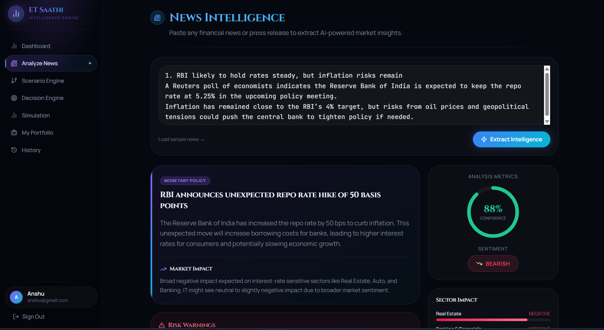

# 💼 ET Saathi  
## Financial Decision & Scenario Simulation Engine

### **AI-powered financial intelligence platform that transforms financial news and user queries into personalized, explainable, and actionable financial decisions.**

 

🔗 **Live Demo:**  
[🚀 Launch ET Saathi](https://beautiful-functionality--24sathawanes.replit.app/login)

 

---

# 📌 Problem Statement

Today, users consume a lot of financial news, but most of them still struggle with one important question:

## **“What should I do after reading this news?”**

Financial platforms usually provide **information**, but they often fail to provide:

- personalized insights  
- scenario-based decision support  
- risk-aware recommendations  
- beginner-friendly explanations  

This creates a major gap between **financial news consumption** and **financial decision-making**.

---

# 🚀 Solution

**ET Saathi** solves this problem by acting as a **Financial Decision Intelligence Engine**.

Instead of behaving like a chatbot, ET Saathi helps users:

- understand the real meaning of financial news  
- simulate **“what-if”** market scenarios  
- analyze impact on sectors and portfolios  
- receive actionable recommendations like **Buy / Hold / Avoid**  
- view risk levels and confidence scores  
- understand **why** a decision is suggested  

> 💡 **In short:** It acts like a **personal AI financial analyst**.

---

# ✨ Key Features

## 🔐 1. Authentication System
- Secure Login / Signup  
- User-specific dashboard access  
- Personalized experience  

---

## 👤 2. User Profile System
Users can create and manage their financial profile by adding:

- Portfolio holdings  
- Risk level (**Low / Medium / High**)  
- Investment goals  

This helps the platform generate more personalized recommendations.

---

## 📰 3. News Analysis Engine
Users can input financial news, and the system analyzes:

- Key financial event  
- Affected sectors  
- Market sentiment  
- Structured AI summary  

This converts long, complex financial news into simple, understandable insights.

---

## 🔮 4. What-If Scenario Simulation
One of the most powerful features of ET Saathi.

Users can ask scenario-based questions like:

> **“What if Reliance falls by 10%?”**

The system then simulates:

- ripple effects across related sectors  
- possible impact on companies  
- market-level reaction  
- decision suggestions for the user  

This helps users think ahead and prepare for uncertainty.

---

## 📈 5. Decision Engine
Based on:

- News analysis  
- Scenario simulation  
- User profile  

ET Saathi generates:

- **Buy / Hold / Avoid**  
- **Confidence Score**  
- **Risk Level**  

This turns raw information into a **decision-ready output**.

---

## 💸 6. Investment Simulation Engine
Users can simulate basic financial outcomes such as:

- If they invest **₹X**  
- Future estimated value  
- Comparison: **Invest vs Not Invest**  

This makes the platform more practical and decision-oriented.

---

## ⚠️ 7. Risk & Validation Layer
The system also detects:

- unrealistic claims  
- low-confidence analysis  
- risky interpretations  

This prevents blind trust and encourages responsible decision-making.

---

## 🧠 8. Explainability Engine
Every recommendation is backed with a clear explanation:

## **Why was this decision made?**

This ensures transparency and helps users understand the logic instead of blindly following AI outputs.

---

# 🎨 UI / UX Highlights

ET Saathi is designed with a **modern, premium, dashboard-style interface**.

## 🎨 Design Theme
- **Primary:** Black `#0D0D0D`  
- **Secondary:** Beige `#F5F5DC`  
- **Accent:** Gold / Muted Orange  

## ✨ UI Highlights
- Clean dashboard layout  
- Smooth modern design  
- Interactive cards  
- Structured output display  
- Easy-to-use financial flow  
- Beginner-friendly user experience  

---

# 🧠 Why ET Saathi Matters

ET Saathi is built to solve a **real-world problem**:

> **People today have access to financial information, but they still do not have financial clarity.**

This platform helps bridge that gap by making financial intelligence:

- simpler  
- personalized  
- explainable  
- action-oriented  

---

# 💼 Business Value / Why This Matters for Economic Times

ET Saathi can create strong business value for financial media platforms like **Economic Times**.

## 📈 Benefits
- Increases **user engagement**  
- Improves **time spent on platform**  
- Encourages **repeat visits**  
- Builds **user trust**  
- Opens **premium feature opportunities**  
- Converts passive readers into active financial users  

## 🎯 Strategic Value
Instead of only delivering financial news, ET Saathi enables the platform to deliver:

# **Financial Decision Intelligence**

That is the future of financial media.

---

# 🛠️ Tech Stack

## Frontend
- React / Modern Web UI  
- Tailwind CSS  
- Interactive dashboard components  

## Backend
- Python  
- API-based architecture  

## AI
- Gemini API / LLM-based analysis engine  

## Database
- PostgreSQL / MongoDB  

---

# 🧩 Core Modules / Architecture

ET Saathi is designed as a modular AI system:

- **News Agent** → extracts financial events  
- **Impact Agent** → analyzes sector/market effect  
- **User Agent** → personalizes output  
- **Decision Agent** → recommends Buy / Hold / Avoid  
- **Simulation Agent** → estimates outcomes  
- **Risk Agent** → validates risky or unrealistic claims  
- **Explainability Agent** → generates reasoning  

---

# 📊 Example Use Cases

## Example 1
**Input:**  
`RBI increases repo rate`

**Output:**  
- Affected sectors: **Banking, Real Estate**  
- Sentiment: **Mixed**  
- Recommendation: **Hold**  
- Risk Level: **Medium**  

---

## Example 2
**Input:**  
`What if Reliance falls 10%?`

**Output:**  
- Energy sector impact  
- Ripple effect across market  
- Possible portfolio risk  
- Decision suggestions  

---

# 🎯 Target Users

ET Saathi is designed for:

- Beginner investors  
- Retail traders  
- Finance learners  
- News readers who want actionable insights  
- Users who want simplified financial understanding  

---

# 🔥 What Makes This Project Unique?

Unlike regular finance apps, ET Saathi is not just:

- a news reader  
- a chatbot  
- or a stock tracker  

It is a system that helps users:

# **Read → Understand → Simulate → Decide**

That makes it much more practical, useful, and impactful.

---

# 📷 Application Preview

> Add your screenshots here for a better GitHub showcase.

## 🔐 Login Page

## 📊 Dashboard

## 📰 News Analysis

## 🔮 Scenario Simulation

## 📈 Decision Engine Output

---

# 🔗 Live Project

👉 **Access ET Saathi Here:**  
[https://11f313ec-242f-4ade-827a-2aff135e65c8-00-2obms23fv08cm.janeway.replit.dev/login](https://beautiful-functionality--24sathawanes.replit.app/login)

---

# 🏁 Conclusion

ET Saathi is more than just a financial tool.

It is a step toward transforming financial news into **intelligent decision support**.

## **Economic Times informs people. ET Saathi empowers them.**
